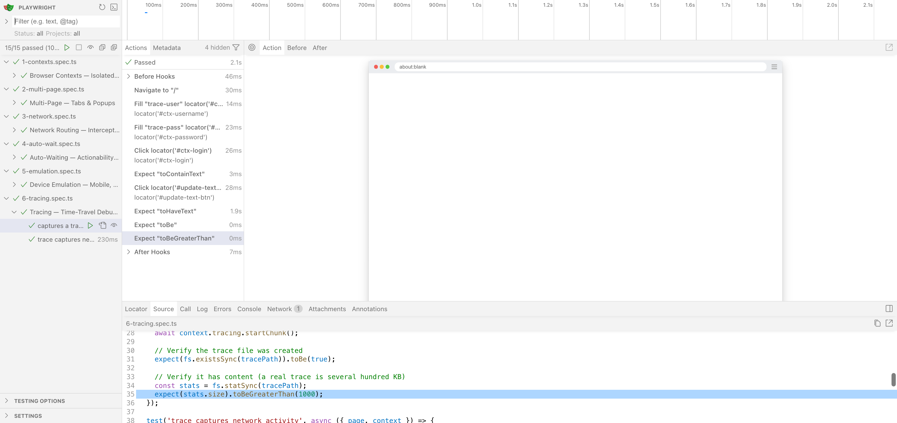
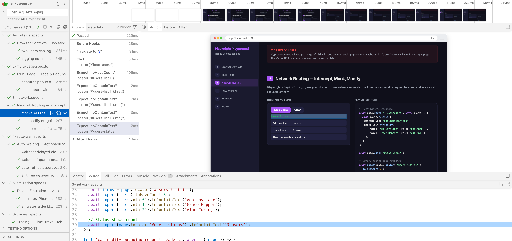
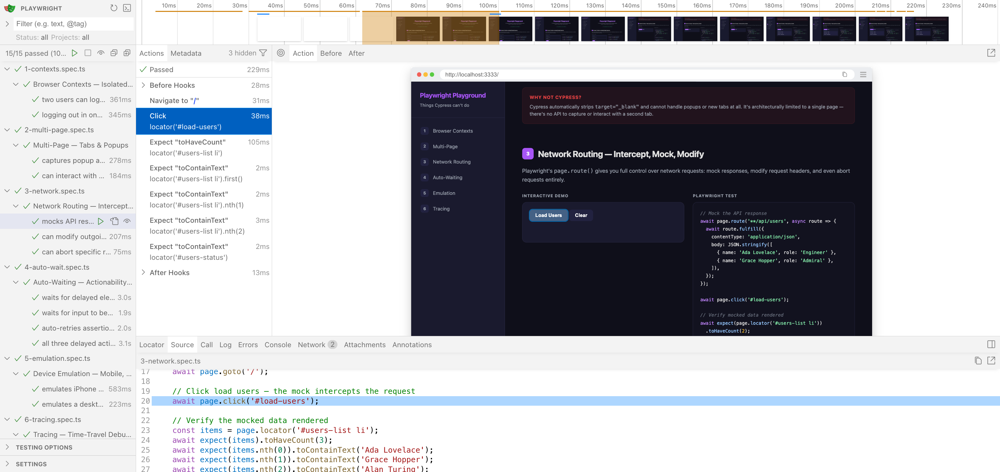
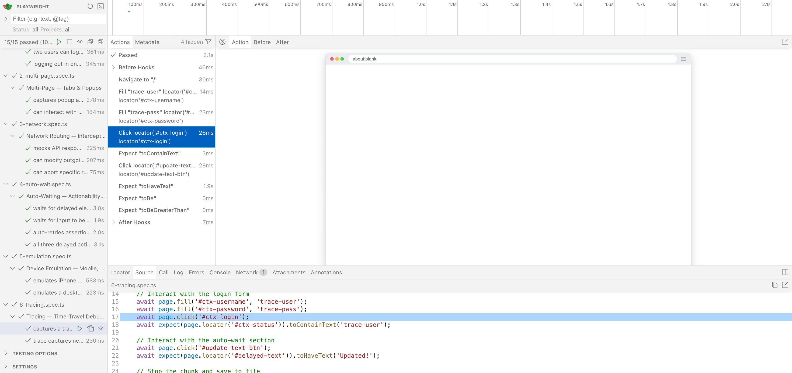

# Playwright Playground


A hands-on exploration of [Playwright](https://playwright.dev/) — browser automation, testing, network interception, tracing, and more.

## Setup

```bash
npm install
npx playwright install
```

## Running Tests

```bash
# Run all tests
npm test

# Run in headed mode (see the browser)
npm run test:headed

# Open UI mode (interactive test runner)
npm run test:ui
```

The dev server (`localhost:3333`) starts automatically via `playwright.config.ts`.

## Screenshots

All 15 tests passing in UI mode:



Network interception test — snapshot view:



Click action test — step-by-step snapshot:



Tracing test — trace viewer snapshot:



## Test Files

| # | File | Topic |
|---|------|-------|
| 1 | `tests/1-contexts.spec.ts` | Browser contexts & isolation |
| 2 | `tests/2-multi-page.spec.ts` | Multi-page interactions |
| 3 | `tests/3-network.spec.ts` | Network interception & mocking |
| 4 | `tests/4-auto-wait.spec.ts` | Auto-waiting & assertions |
| 5 | `tests/5-emulation.spec.ts` | Device & locale emulation |
| 6 | `tests/6-tracing.spec.ts` | Tracing & debugging |
